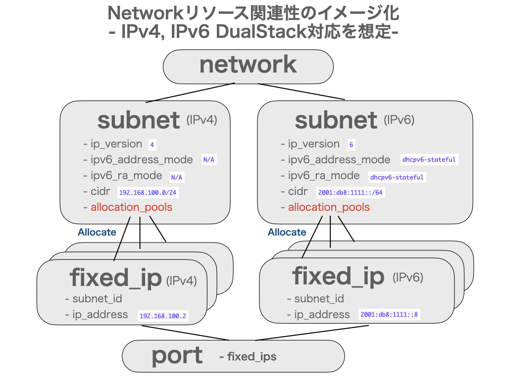

# sample-ipam-server

This tool aims to confirm how ipam mechanism on neutron-server works
And then, we can learn how to allocate or deallocate fixed_ips under following diagram

## How to Run

Starting sample ipam program as following

    $ python sample_ipam_server.py
    Bottle v0.12.17 server starting up (using WSGIRefServer())...
    Listening on http://0.0.0.0:8080/
    Hit Ctrl-C to quit.

## (1) How to allocate fixed_ip for addressing IPv4

### (1-1) How to allocate fixed_ip

Let's create some fixed_ips
First of all, you should create fixed_ip using "dhcp" as "device_owner"

    $ curl -X POST http://127.0.0.1:8080/fixed_ips \
    > -H "Content-Type: application/json" \
    > -d @- << EOF | jq .
    > {
    >     "fixed_ip": {
    >         "subnet_id": "11111111-1111-1111-1111-111111111111",
    >         "allocation_pools": [{"start": "192.168.100.2", "end": "192.168.100.254"}],
    >         "cidr": "192.168.100.0/24",
    >         "gateway_ip": "192.168.100.1",
    >         "mac_address": null,
    >         "device_owner": "dhcp",
    >         "ip_address": null
    >     }
    > }
    > EOF
    {
      "fixed_ip": [
        {
          "subnet_id": "11111111-1111-1111-1111-111111111111",
          "ip_address": "192.168.100.2"
        }
      ]
    }

Secondly, if you want to assign allocated_ip_address automatically, you can handle it

    $ curl -X POST http://127.0.0.1:8080/fixed_ips \
    > -H "Content-Type: application/json" \
    > -d @- << EOF | jq .
    > {
    >     "fixed_ip": {
    >         "subnet_id": "11111111-1111-1111-1111-111111111111",
    >         "allocation_pools": [{"start": "192.168.100.2", "end": "192.168.100.254"}],
    >         "cidr": "192.168.100.0/24",
    >         "gateway_ip": "192.168.100.1",
    >         "mac_address": null,
    >         "device_owner": null,
    >         "ip_address": null
    >     }
    > }
    > EOF
    {
      "fixed_ip": [
        {
          "subnet_id": "11111111-1111-1111-1111-111111111111",
          "ip_address": "192.168.100.5"
        }
      ]
    }

Thirdly, try it again using allocated_ip_address automatically

    $ curl -X POST http://127.0.0.1:8080/fixed_ips \
    > -H "Content-Type: application/json" \
    > -d @- << EOF | jq .
    > {
    >     "fixed_ip": {
    >         "subnet_id": "11111111-1111-1111-1111-111111111111",
    >         "allocation_pools": [],
    >         "cidr": "192.168.100.0/24",
    >         "gateway_ip": "192.168.100.1",
    >         "mac_address": null,
    >         "device_owner": null,
    >         "ip_address": null
    >     }
    > }
    > EOF
    {
      "fixed_ip": [
        {
          "subnet_id": "11111111-1111-1111-1111-111111111111",
          "ip_address": "192.168.100.24"
        }
      ]
    }

Fourthly, if you want to assign fixed_ip_address (ex. 192.168.100.101), you can handle it

    $ curl -X POST http://127.0.0.1:8080/fixed_ips \
    > -H "Content-Type: application/json" \
    > -d @- << EOF | jq .
    > {
    >     "fixed_ip": {
    >         "subnet_id": "11111111-1111-1111-1111-111111111111",
    >         "allocation_pools": [],
    >         "cidr": "192.168.100.0/24",
    >         "gateway_ip": "192.168.100.1",
    >         "mac_address": null,
    >         "device_owner": null,
    >         "ip_address": "192.168.100.101"
    >     }
    > }
    > EOF
    {
      "fixed_ip": [
        {
          "subnet_id": "11111111-1111-1111-1111-111111111111",
          "ip_address": "192.168.100.101"
        }
      ]
    }

And then, you can confirm current fixed_ips for specific subnet

    $ curl -X GET http://127.0.0.1:8080/fixed_ips?subnet_id=11111111-1111-1111-1111-111111111111 | jq .
    {
      "fixed_ips": [
        {
          "subnet_id": "11111111-1111-1111-1111-111111111111",
          "ip_address": "192.168.100.2"
        },
        {
          "subnet_id": "11111111-1111-1111-1111-111111111111",
          "ip_address": "192.168.100.5"
        },
        {
          "subnet_id": "11111111-1111-1111-1111-111111111111",
          "ip_address": "192.168.100.24"
        },
        {
          "subnet_id": "11111111-1111-1111-1111-111111111111",
          "ip_address": "192.168.100.101"
        }
      ]
    }

### (1-2) How to deallocate fixed_ip

If you don't need allocated_ip_address on fixed_ip, you can release allocated ip address (ex. 192.168.100.24)

    $ curl -X DELETE http://127.0.0.1:8080/fixed_ips \
    > -H "Content-Type: application/json" \
    > -d @- << EOF | jq .
    > {
    >     "fixed_ip": {
    >         "subnet_id": "11111111-1111-1111-1111-111111111111",
    >         "ip_address": "192.168.100.24"
    >     }
    > }
    > EOF
    {
      "fixed_ip": [
        {
          "subnet_id": "11111111-1111-1111-1111-111111111111",
          "ip_address": "192.168.100.24"
        }
      ]
    }

And then, you can confirm current fixed_ips for specific subnet

    $ curl -X GET http://127.0.0.1:8080/fixed_ips?subnet_id=11111111-1111-1111-1111-111111111111 | jq .
    {
      "fixed_ips": [
        {
          "subnet_id": "11111111-1111-1111-1111-111111111111",
          "ip_address": "192.168.100.2"
        },
        {
          "subnet_id": "11111111-1111-1111-1111-111111111111",
          "ip_address": "192.168.100.5"
        },
        {
          "subnet_id": "11111111-1111-1111-1111-111111111111",
          "ip_address": "192.168.100.101"
        }
      ]
    }

## (2) How to allocate fixed_ip for addressing IPv6 with DHCPv6-stateful

### (2-1) How to allocate fixed_ip

Let's create some fixed_ips
First of all, you should create fixed_ip using "dhcp" as "device_owner"

    $ curl -X POST http://127.0.0.1:8080/fixed_ips \
    > -H "Content-Type: application/json" \
    > -d @- << EOF | jq .
    > {
    >     "fixed_ip": {
    >         "subnet_id": "22222222-2222-2222-2222-222222222222",
    >         "allocation_pools": [],
    >         "cidr": "2001:db8:1111::/64",
    >         "gateway_ip": "2001:db8:1111::1",
    >         "mac_address": null,
    >         "device_owner": "dhcp",
    >         "ip_address": null
    >     }
    > }
    > EOF
    {
      "fixed_ip": [
        {
          "subnet_id": "22222222-2222-2222-2222-222222222222",
          "ip_address": "2001:db8:1111::2"
        }
      ]
    }

Secondly, if you want to assign allocated_ip_address automatically, you can handle it

    $ curl -X POST http://127.0.0.1:8080/fixed_ips \
    > -H "Content-Type: application/json" \
    > -d @- << EOF | jq .
    > {
    >     "fixed_ip": {
    >         "subnet_id": "22222222-2222-2222-2222-222222222222",
    >         "allocation_pools": [],
    >         "cidr": "2001:db8:1111::/64",
    >         "gateway_ip": "2001:db8:1111::1",
    >         "mac_address": null,
    >         "device_owner": null,
    >         "ip_address": null
    >     }
    > }
    > EOF
    {
      "fixed_ip": [
        {
          "subnet_id": "22222222-2222-2222-2222-222222222222",
          "ip_address": "2001:db8:1111::9"
        }
      ]
    }

Thirdly, try it again using allocated_ip_address automatically

    $ curl -X POST http://127.0.0.1:8080/fixed_ips \
    > -H "Content-Type: application/json" \
    > -d @- << EOF | jq .
    > {
    >     "fixed_ip": {
    >         "subnet_id": "22222222-2222-2222-2222-222222222222",
    >         "allocation_pools": [],
    >         "cidr": "2001:db8:1111::/64",
    >         "gateway_ip": "2001:db8:1111::1",
    >         "mac_address": null,
    >         "device_owner": null,
    >         "ip_address": null
    >     }
    > }
    > EOF
    {
      "fixed_ip": [
        {
          "subnet_id": "22222222-2222-2222-2222-222222222222",
          "ip_address": "2001:db8:1111::a"
        }
      ]
    }

Fourthly, if you want to assign fixed_ip_address (ex. 2001:db8:1111::101), you can handle it

    $ curl -X POST http://127.0.0.1:8080/fixed_ips \
    > -H "Content-Type: application/json" \
    > -d @- << EOF | jq .
    > {
    >     "fixed_ip": {
    >         "subnet_id": "22222222-2222-2222-2222-222222222222",
    >         "allocation_pools": [],
    >         "cidr": "2001:db8:1111::/64",
    >         "gateway_ip": "2001:db8:1111::1",
    >         "mac_address": null,
    >         "device_owner": null,
    >         "ip_address": "2001:db8:1111::101"
    >     }
    > }
    > EOF
    {
      "fixed_ip": [
        {
          "subnet_id": "22222222-2222-2222-2222-222222222222",
          "ip_address": "2001:db8:1111::101"
        }
      ]
    }

And then, you can confirm current fixed_ips for specific subnet

    $ curl -X GET http://127.0.0.1:8080/fixed_ips?subnet_id=22222222-2222-2222-2222-222222222222 | jq .
    {
      "fixed_ips": [
        {
          "subnet_id": "22222222-2222-2222-2222-222222222222",
          "ip_address": "2001:db8:1111::2"
        },
        {
          "subnet_id": "22222222-2222-2222-2222-222222222222",
          "ip_address": "2001:db8:1111::9"
        },
        {
          "subnet_id": "22222222-2222-2222-2222-222222222222",
          "ip_address": "2001:db8:1111::a"
        },
        {
          "subnet_id": "22222222-2222-2222-2222-222222222222",
          "ip_address": "2001:db8:1111::101"
        }
      ]
    }

### (2-2) How to deallocate fixed_ip

If you don't need allocated ip address on fixed_ip, you can release allocated ip address (ex. 2001:db8:1111::a)

    $ curl -X DELETE http://127.0.0.1:8080/fixed_ips \
    > -H "Content-Type: application/json" \
    > -d @- << EOF | jq .
    > {
    >     "fixed_ip": {
    >         "subnet_id": "22222222-2222-2222-2222-222222222222",
    >         "ip_address": "2001:db8:1111::a"
    >     }
    > }
    > EOF
    {
      "fixed_ip": [
        {
          "subnet_id": "22222222-2222-2222-2222-222222222222",
          "ip_address": "2001:db8:1111::a"
        }
      ]
    }

And then, you can confirm current fixed_ips for specific subnet

    $ curl -X GET http://127.0.0.1:8080/fixed_ips?subnet_id=22222222-2222-2222-2222-222222222222 | jq .
    {
      "fixed_ips": [
        {
          "subnet_id": "22222222-2222-2222-2222-222222222222",
          "ip_address": "2001:db8:1111::2"
        },
        {
          "subnet_id": "22222222-2222-2222-2222-222222222222",
          "ip_address": "2001:db8:1111::9"
        },
        {
          "subnet_id": "22222222-2222-2222-2222-222222222222",
          "ip_address": "2001:db8:1111::101"
        }
      ]
    }

## (3) How to allocate fixed_ip for addressing IPv6 with SLAAC

### (3-1) How to allocate fixed_ip

Let's create some fixed_ips
First of all, (ex. "fa:16:3e:ef:03:01")

    $ curl -X POST http://127.0.0.1:8080/fixed_ips \
    > -H "Content-Type: application/json" \
    > -d @- << EOF | jq .
    > {
    >     "fixed_ip": {
    >         "subnet_id": "33333333-3333-3333-3333-333333333333",
    >         "allocation_pools": [],
    >         "cidr": "2001:db8:1111::/64",
    >         "gateway_ip": null,
    >         "mac_address": "fa:16:3e:ef:03:01",
    >         "device_owner": null
    >     }
    > }
    > EOF
    {
      "fixed_ip": [
        {
          "subnet_id": "33333333-3333-3333-3333-333333333333",
          "ip_address": "2001:db8:1111:0:f816:3eff:feef:301"
        }
      ]
    }

Secondly, (ex. "fa:16:3e:ef:03:02")

    $ curl -X POST http://127.0.0.1:8080/fixed_ips \
    > -H "Content-Type: application/json" \
    > -d @- << EOF | jq .
    > {
    >     "fixed_ip": {
    >         "subnet_id": "33333333-3333-3333-3333-333333333333",
    >         "allocation_pools": [],
    >         "cidr": "2001:db8:1111::/64",
    >         "gateway_ip": null,
    >         "mac_address": "fa:16:3e:ef:03:02",
    >         "device_owner": null
    >     }
    > }
    > EOF
    {
      "fixed_ip": [
        {
          "subnet_id": "33333333-3333-3333-3333-333333333333",
          "ip_address": "2001:db8:1111:0:f816:3eff:feef:302"
        }
      ]
    }

Thirdly, (ex. "fa:16:3e:ef:03:03")

    $ curl -X POST http://127.0.0.1:8080/fixed_ips \
    > -H "Content-Type: application/json" \
    > -d @- << EOF | jq .
    > {
    >     "fixed_ip": {
    >         "subnet_id": "33333333-3333-3333-3333-333333333333",
    >         "allocation_pools": [],
    >         "cidr": "2001:db8:1111::/64",
    >         "gateway_ip": null,
    >         "mac_address": "fa:16:3e:ef:03:03",
    >         "device_owner": null
    >     }
    > }
    > EOF
    {
      "fixed_ip": [
        {
          "subnet_id": "33333333-3333-3333-3333-333333333333",
          "ip_address": "2001:db8:1111:0:f816:3eff:feef:303"
        }
      ]
    }

And then, you can confirm current fixed_ips for specific subnet

    $ curl -X GET http://127.0.0.1:8080/fixed_ips?subnet_id=33333333-3333-3333-3333-333333333333 | jq .
    {
      "fixed_ips": [
        {
          "subnet_id": "33333333-3333-3333-3333-333333333333",
          "ip_address": "2001:db8:1111:0:f816:3eff:feef:301"
        },
        {
          "subnet_id": "33333333-3333-3333-3333-333333333333",
          "ip_address": "2001:db8:1111:0:f816:3eff:feef:302"
        },
        {
          "subnet_id": "33333333-3333-3333-3333-333333333333",
          "ip_address": "2001:db8:1111:0:f816:3eff:feef:303"
        }
      ]
    }

### (3-2) How to deallocate fixed_ip

If you don't need allocated ip address on fixed_ip, you can release allocated ip address (ex. 2001:db8:1111:0:f816:3eff:feef:301)

    $ curl -X DELETE http://127.0.0.1:8080/fixed_ips \
    > -H "Content-Type: application/json" \
    > -d @- << EOF | jq .
    > {
    >     "fixed_ip": {
    >         "subnet_id": "33333333-3333-3333-3333-333333333333",
    >         "ip_address": "2001:db8:1111:0:f816:3eff:feef:301"
    >     }
    > }
    > EOF
    {
      "fixed_ip": [
        {
          "subnet_id": "33333333-3333-3333-3333-333333333333",
          "ip_address": "2001:db8:1111:0:f816:3eff:feef:301"
        }
      ]
    }

And then, you can confirm current fixed_ips for specific subnet

    $ curl -X GET http://127.0.0.1:8080/fixed_ips?subnet_id=33333333-3333-3333-3333-333333333333 | jq .
    {
      "fixed_ips": [
        {
          "subnet_id": "33333333-3333-3333-3333-333333333333",
          "ip_address": "2001:db8:1111:0:f816:3eff:feef:302"
        },
        {
          "subnet_id": "33333333-3333-3333-3333-333333333333",
          "ip_address": "2001:db8:1111:0:f816:3eff:feef:303"
        }
      ]
    }

That's all
